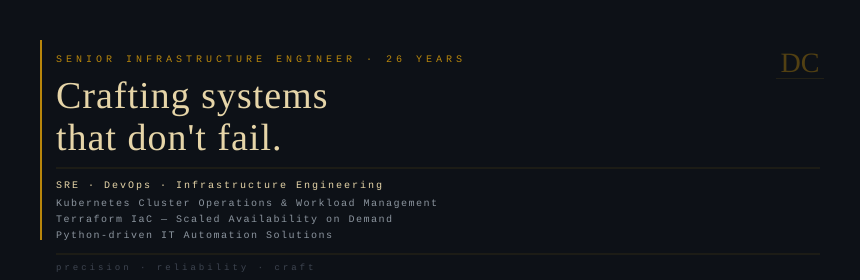

<!-- Damien Cooke — GitHub Profile README -->

 

 

---

  
<code>SRE · DevOps · Infrastructure Engineering</code> 
  
<code>Kubernetes Cluster Operations &amp; Workload Management</code> 

<code>Terraform IaC — Scaled Availability on Demand</code> 

<code>Python-driven IT Automation Solutions</code>

---

| **26** | **99.999%** | **0** |
|:---:|:---:|:---:|
| YEARS IN PRODUCTION | UPTIME STANDARD | TOLERANCE FOR DRIFT |

---

## Core Disciplines

**`⬡` Kubernetes Operations**
&nbsp;&nbsp;&nbsp;&nbsp;Cluster design, workload orchestration, scheduling strategy, and multi-tenant namespace governance at scale.

**`⬡` Infrastructure as Code**
&nbsp;&nbsp;&nbsp;&nbsp;Terraform-managed environments with modular, version-controlled, reproducible provisioning across cloud providers.

**`⬡` Site Reliability Engineering**
&nbsp;&nbsp;&nbsp;&nbsp;SLO definition, incident response frameworks, post-mortem culture, and eliminating toil through disciplined automation.

**`⬡` Python Automation**
&nbsp;&nbsp;&nbsp;&nbsp;Purpose-built tooling and pipelines that replace manual processes with deterministic, auditable, repeatable workflows.

---

## Stack

<table>
<tr>
<td valign="top" width="50%">

**PROGRAMMING & AUTOMATION**
- Python · Bash / Shell
- Regex · API Integration
- File & System Automation
- Task Scheduling

</td>
<td valign="top" width="50%">

**INFRASTRUCTURE & CONFIG**
- Kubernetes · Terraform · Docker
- Puppet · Git / GitHub

</td>
</tr>
<tr>
<td valign="top">

**CLOUD & OBSERVABILITY**
- Google Cloud Platform (GCP)
- Amazon Web Services (AWS)
- Splunk · Log Analysis
- System Monitoring

</td>
<td valign="top">

**SRE & IT OPERATIONS**
- Incident Management · Root-Cause-Analysis
- MTTR Optimization
- Network Troubleshooting
- Debugging

</td>
</tr>
<tr>
<td valign="top">

**DATA & FORMATS**
- SQL · JSON · YAML · XML · CSV · HTML

</td>
<td valign="top">

**OPERATING SYSTEMS**
- Linux / Unix · Windows · MacOS

</td>
</tr>
</table>

---

## Projects

| Project | Link |
|:---|:---:|
| Python Automation Project | [→ Automation Portfolio in Python](https://github.com/damienncooke-dev/Automation-Portfolio/tree/main/Automate-Workflow-Vendor-Site-Update) |
| Kubernetes Deployment Project | [→ Orchestration Project in GKE](https://github.com/damienncooke-dev/SRE-Projects-Portfolio/tree/main/K8s-Orchestration-GCP) |
| Terraform (IaC) Project | [→ Terraform AWS Automation Project](https://github.com/damienncooke-dev/SRE-Projects-Portfolio/tree/main/Terraform-AWS-Deploy-Demo) |

---

*"The mark of mature infrastructure is not how fast it scales —*
*it's that no one notices when it does."*

— D.C.

 

🟢 &nbsp; OPEN TO SENIOR & PRINCIPAL ROLES

precision · reliability · craft

 

 
 

GitHub [profile view counter]](https://github.com/antonkomarev/github-profile-views-counter)

 

